# Bộ sơ đồ dùng cho báo cáo CRM Mini

File này dùng cú pháp Mermaid. Có thể dán từng khối vào Markdown, Notion, GitHub, Mermaid Live Editor hoặc xuất thành ảnh để đưa vào Word.

## 1. Sơ đồ kiến trúc hệ thống

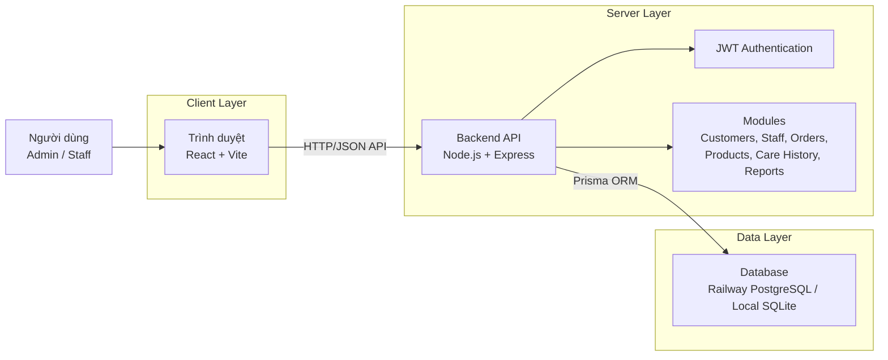

## 2. Sơ đồ triển khai đồng bộ dữ liệu

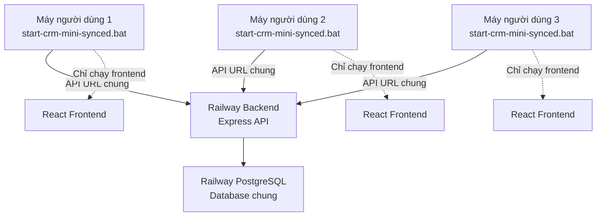

## 3. Sơ đồ Use Case tổng quan

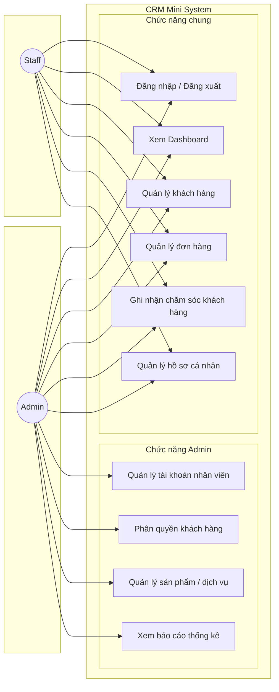

## 4. Sơ đồ phân quyền Admin và Staff

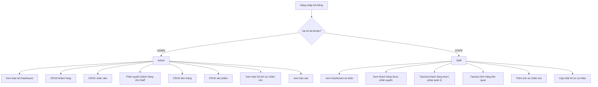

## 5. Sơ đồ ERD cơ sở dữ liệu

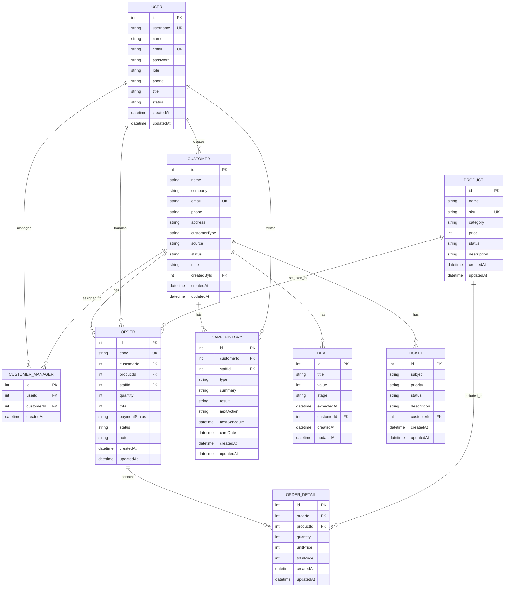

## 6. Sơ đồ luồng đăng nhập

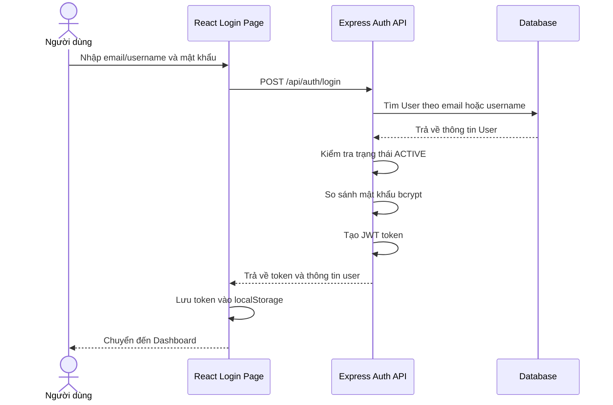

## 7. Sơ đồ luồng quản lý khách hàng

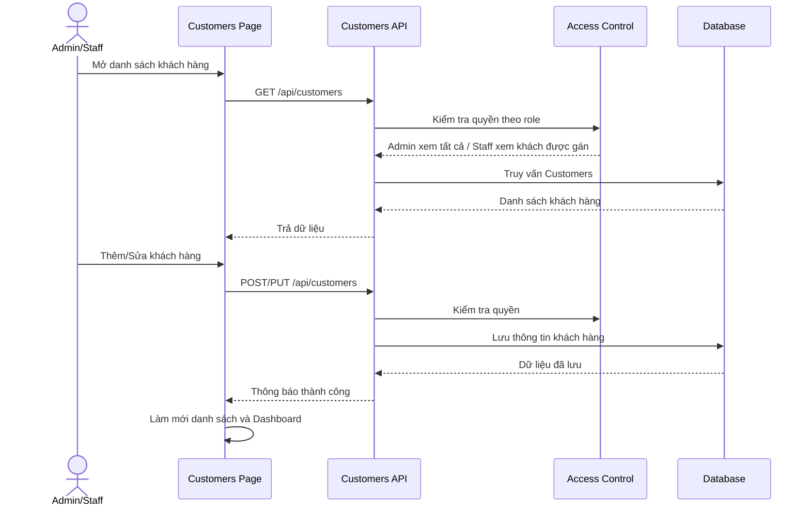

## 8. Sơ đồ luồng phân quyền Staff quản lý khách hàng

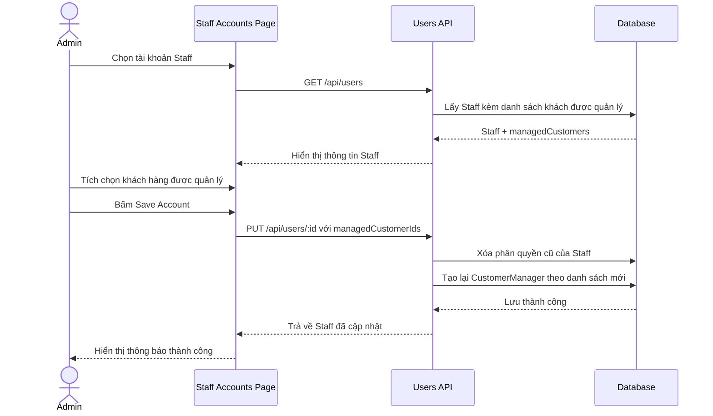

## 9. Sơ đồ luồng tạo đơn hàng

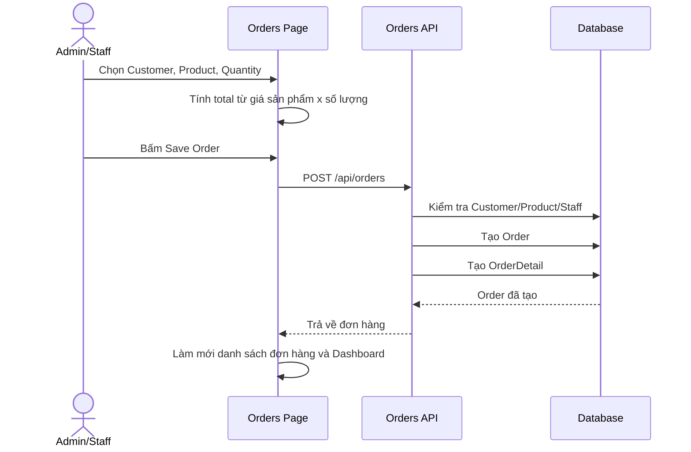

## 10. Sơ đồ Activity: Quy trình chăm sóc khách hàng

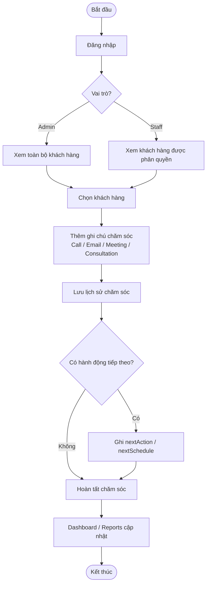

## 11. Sơ đồ Activity: Quy trình vận hành tổng quan

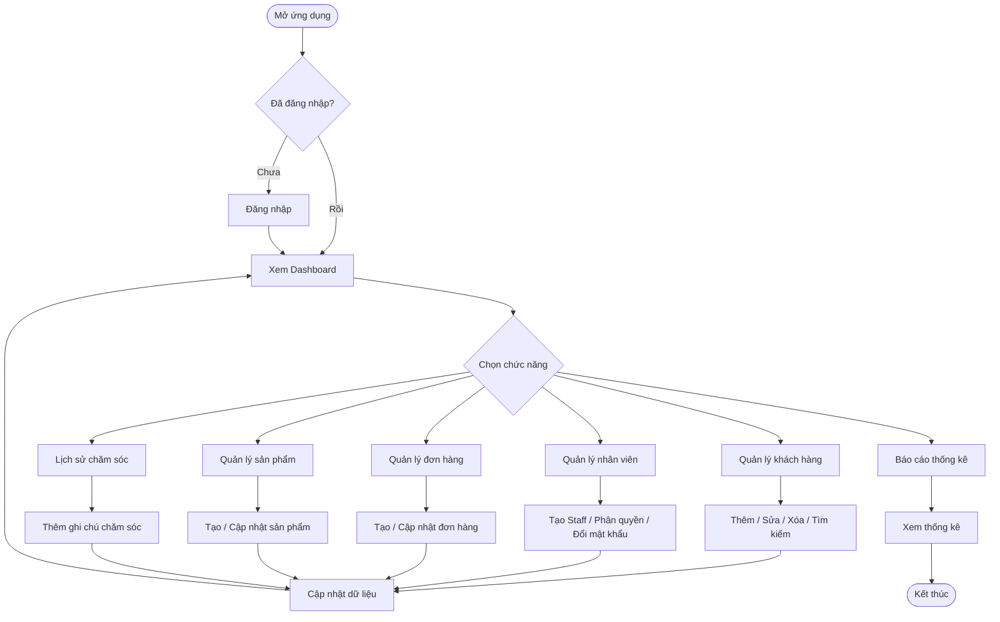
